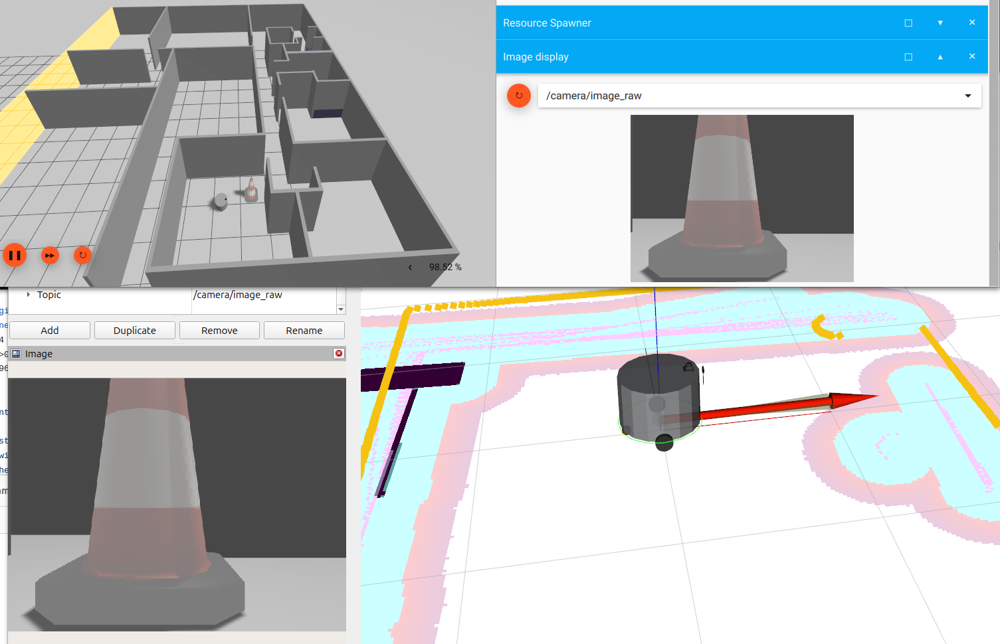
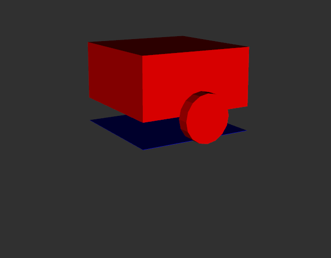
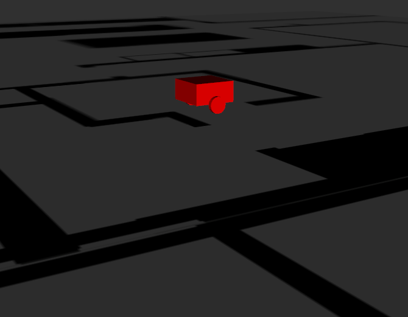

# URDFS or Uniform Resource Definition Files

## Setup

If you haven't done so yet, you need to create a ROS 2 workspace to hold the book code.

```bash
# Do the following if you haven't already created a workspace for this book code.
mkdir -p ~/wr_book_ws/src && cd ~/wr_book_ws/src # Change 'wr_book_ws' if you need a different name or location
git clone git@github.com:wimblerobotics/Robotics_Book.git
cd .. # Should be back at ~/wr_book_ws
colcon build --symlink-install
source install/setup.bash
```

## What is a URDF?

The abbreviation URDF stands for *Unified Robot Description Format*.
A URDF is a text file that describes a robot's physical structure.
It can be used, for instance, to create a simulated image of what the robot looks like.
It can do more than just that, though, such as provide kinematic properties so that a full,
physics-base simulator can simulate the robot acting and moving in a simulated world.
But at the core, even without simulation, even without visualization, a URDF is primarily
just an easier way to describe how to translate data from one frame of reference to another.

As an example, suppose you have a LIDAR sensor mounted high up on the robot.
And you have a camera mounted about half way up on the left side of the robot.
Both the camera and the LIDAR can see an obstacle a bit ahead of the robot.
How is the robot to understand where the obstacle really is so it can issue motor
commands to avoid it? 
It does so by translating the sensor data from the frame of reference of the LIDAR and
the sensor data from the frame of reference of the camera into a common frame
of reference—perhaps that of the very center of the robot.

It's not important that it's the center of the robot, only that the robot can translate any
location-based data from any frame of reference to any other frame of reference.
In ROS, those translations happen using a concept called *transforms*, which are powered
by *frames*, and here comes the punchline, a URDF provides an easy way to define most or
all of the frames of reference in a robot, and ROS does the rest.

For now, think of a URDF as a list of parts, called *links* and a list of descriptions
about how those links are connected, called *joints*.

We will next use a URDF that describes a two wheeled robot with a square body.
We will use the ROS tool *rviz2* to visualize the robot.
We will build on the knowledge of URDF over a few steps, starting with a relatively simple sample and then we
will add more complexity and eventually add in the use of a macro processor to simplify
how you write the description.

## Step 1: The first URDF file

A URDF file is an [XML](https://www.w3schools.com/xml/) file. You can create one using any text editor or with an IDE that makes it easy to create valid XML code. Let's begin with this simple URDF which is in the [1.urdf](../../description/urdf/1.urdf) file.

```xml
<?xml version="1.0"?>
<robot name="simple_robot">
  <link name="base_link">
    <visual>
      <geometry>
        <box size="0.5 0.5 0.25"/>
      </geometry>
      <pose>0 0 0.125 0 0 0</pose>
    </visual>
  </link>
  <link name="left_wheel">
    <visual>
      <geometry>
        <cylinder radius="0.1" length="0.05"/>
      </geometry>
    </visual>
  </link>
  <joint name="left_wheel_joint" type="continuous">
    <parent link="base_link"/>
    <child link="left_wheel"/>
    <origin xyz="0 -0.29 -0.13" rpy="1.5708 0 0"/>
    <axis xyz="0 1 0"/>
  </joint>
  <link name="right_wheel">
    <visual>
      <geometry>
        <cylinder radius="0.1" length="0.05"/>
      </geometry>
    </visual>
  </link>
  <joint name="right_wheel_joint" type="continuous">
    <parent link="base_link"/>
    <child link="right_wheel"/>
    <origin xyz="0 0.29 -0.13" rpy="1.5708 0 0"/>
    <axis xyz="0 1 0"/>
  </joint>

</robot>
```

To make it easier to understand as I explain what the URDF is describing,
here is what the URDF file looks like using the *rviz2* tool, though the image is only a
slice of what *rviz2* can show, and *rviz2* can do much more than simply visualize this
URDF file:


To see the visualization yourself, you can run the following command:

```bash
cd ~/wr_book_ws # Change this if you have a different workspace name
colcon build --symlink-install
source install/setup.bash
ros2 launch description description.launch.py urdf_file_name:="1.urdf"
```

## Explaining 1.urdf

The first line, `<?xml version="1.0"?>`, is the XML declaration.
It tells the parser reading the text file that this is an XML file and what version
of XML it is.

The next line, `<robot name="simple_robot">`, is the start of the robot description.
The `name` attribute is the name of the robot.
The robot description ends with `</robot>` in the last line of the file.

Next come link and joint pairs.
Remember that link elements define real, physical components of the robot and joint elements
define how those links are connected.
In this file, we have three links:
`base_link`, `left_wheel`, and `right_wheel`.
We also have two joints: `left_wheel_joint` and `right_wheel_joint`.

Let's look at the first link, which describes the square box forming the body of the robot:

```xml
  <link name="base_link">
    <visual>
      <geometry>
        <box size="0.5 0.5 0.25"/>
      </geometry>
      <pose>0 0 0.125 0 0 0</pose>
    </visual>
  </link>
```

The name `base_link` is chosen because the ROS [rep 105](https://www.ros.org/reps/rep-0105.html)
suggests that the base link should be the name of the link that is fixed to the world.
I'll explain what that means later on.

The `base_link` link is a box with dimensions of 0.5 meters in the x (length) direction,
0.5 meters in the y (width) direction, and 0.25 meters in the z (height) direction.

Now look at one of the two wheels:

```xml
  <link name="left_wheel">
    <visual>
      <geometry>
        <cylinder radius="0.1" length="0.05"/>
      </geometry>
    </visual>
  </link>
```

The `left_wheel` is a cylinder with a radius of 0.1 meters and a length of 0.05 meters.
The left and right wheels are physically identical, differing only where they are attached
to the body of the robot, so the *link* for the `right_wheel` is the same as that for
the `left_wheel`

Now let's look at how those three parts, those three *links*, are connected.
Lets begin with how the left wheel connects to the body of the robot:

```xml
  <joint name="left_wheel_joint" type="continuous">
    <parent link="base_link"/>
    <child link="left_wheel"/>
    <origin xyz="0 -0.29 -0.13" rpy="1.5708 0 0"/>
    <axis xyz="0 1 0"/>
  </joint>
```

A *joint* is a connection between two *links*. One end of the connection is called the *parent*
link and the other is called the child link.
The order is important as the *origin* describes how the child is placed in relation to the parent.
Here, the *left_wheel* is placed 0.29 meters to the left of the center of the *base_link* and
0.13 meters below the center of the *base_link*.
The wheel is at the center of the *base_link* in the x direction.

Without the *rpy*, the wheel would be pointed upwards, lying parallel to the ground, just like the body of the robot.
The *rpy* (roll, pitch and yaw orienetation in radians) says to rotate the wheel 90 degrees (1.5708 radians) about the
x axis relative to the body of the robot so that the wheel is upright as you would expect.

The *axis* element describes the axis of rotation for the joint, which is the y axis in this case,
and means that if the wheel is rotated, it will rotate about the y axis.
The joint is of type *continuous* which means the wheel can rotate continuously.

There are other types of joints, such as *fixed*, which means the two links are fixed in relation
to each other and cannot move relative to each other, but a wheel needs to rotate, so we use
*continuous*. Will will see other types of joints in later examples.

The joint for the right wheel is the same as the joint for the left wheel, except that the
right wheel is placed 0.29 meters to the right of the center of the *base_link*.

## Frames of Reference

It's important to understand frames of reference and how they are used in ROS.
Probably the most important concepts in ROS are *topics*, *frames* and *transforms*.
A *topic* is a way to send data from one node to another and will be covered in a later chapter,
along with *nodes*.
A *frame* is a way to describe a location in space but also corresponds to a *frame of reference*,
a point of view for seeing the world.

In the *rviz2* image above, the *base_link* is the frame of reference for the robot and we are looking
at the world from that point of view, even though the "viewing camera" is positioned
off to the side of the robot.
In that image, you can see a grid off white lines showing the *plane* of the *base_link*.
Notice that the *base_link* is at the center of the robot.
The frame always corresponds to the center of the *link* object.

We could easily change our point of view to be from the *left_wheel* frame of reference, or the *right_wheel*.
Here is what the robot looks like from the *right_wheel* frame of reference:


Note that the grid of white lines is now centered on the right wheel which is the frame of reference
for this image, through I've oriented the view in such a way that you can hardly tell it's actually showing as a grid.
In *rviz2*, you can change the frame of reference by selecting the frame you want to view from in the
*Fixed Frame* drop down menu under the *Global Options* in the *Displays* panel.

The *rviz2* tool is a powerful visualization tool that can show many things, but for now, we are only
using it to show the robot from different frames of reference.

To further help you understand frames of reference, consider the following example.



Suppose you have a camera mounted in front and to the left of a circular robot.
The camera is looking at a traffic cone that is just over a meter in front of the robot and off to the left about
a quarter of a meter.
The robot wants to move so it is nearly touching the cone just in front of the position that the camera sees.
The camera tells the robot that the cone is just over one meter straight ahead.
If the robot where to travel straight ahead, it wouldn't be in front of the cone at all.
The robot needs to know where the cone is in relation to the robot's circular body, not the camera's body.

This is where *frames* and *transforms* come in. When ROS looks at the URDF describing the robot body and the
camera, it can figure out how to translate any pixel location from the camera's frame of reference to the
location that the pixel represents in the robot body's frame of reference. The would be true even if the camera
were twisted or turned or mounted in a different position. The URDF would describe the new position of the camera.

The software that moves the robot computes the needed path based upon the location of the center of the
robot's body, not the camera's body.
ROS can translate the location of the cone from the camera's frame of reference to the robot's frame of reference,
telling the robot that, from the robot body's point of view, the cone is just about a quarter meter the left and a
just over a meter in front.

In the image above, so you know, the upper left quadrant is a simulation of a circular robot with a camera mounted
on the front left, looking at a traffic cone, all within the simulation of a house.
This image is provided by the *gazebo* simulator, which is a powerful tool for simulating robots in a virtual world.
The upper right quadrant is also from *gazebo* and shows the picture from the camera. The lower left quadrant is
that same camera image but visualized with the *rviz2* tools The lower right quadrant is also from *rviz2* and shows
a visualization of the robot, the laser scan as yellow dots, the direction of the front of the robot as a red arrow and a "cost map" in
shades of light blue and pink. This is will be explained in a later chapter.

## Another frame example

Now consider our simple robot with the square body and two wheels but we will add in a "map" of the world.
When you want to autonomously move our robot using ROS, you will need to provide a map of the world and
a way to know where the robot is in the world on that map.
This will be covered later on in the book, but for now we will just add a fake map as a motivation to talk
about frames.

In addition to introducing a map, we will also add one more link to the robot, a "base_footprint" link.
By convention, the "base_footprint" link is the link that is at the bottom of the robot, it corresponds
to the floor or ground for our robot. The wheels sit atop the base_footprint.

To add a base_footprint to our URDF, we will add the following:

```xml
  <!-- Here is the base_footprint -->
  <material name="blue">
    <color rgba="0 0 1 1"/>
  </material>
  <link name="base_footprint">
    <visual>
      <geometry>
        <box size="0.5 0.5 0.001"/>
      </geometry>
      <pose>0 0 0 0 0 0</pose>
      <material name="blue"/>
    </visual>
  </link>

  <joint name="base_footprint_joint" type="fixed">
    <parent link="base_link"/>
    <child link="base_footprint"/>
    <origin xyz="0 0 -0.23" rpy="0 0 0"/>
  </joint>
```

The *base_footprint* link is a box that the same width and length of the robot body, but only one thousandth of a meter
thick and colored blue.
The blue coloring is achieved by first defining a new element called *material* and then using that material
in the *visual* element for the *base_footprint* link.
The *base_footprint_joint* is a *fixed* joint, meaning that the two links are fixed in relation to each other
and cannot move, unlike the wheel joints which are *continuous* and can rotate.
The *base_footprint* is placed 0.23 meters below the center of the *base_link* using the *origin* element.
This nicely places the base_footprint at the bottom of the robot, where the floor should be.
By making the *base_footprint* link the same size as the robot body, and positioning as I did,
*base_footprint* looks like shadow of the robot cast onto the floor in the *rviz2* tool.

If we were to look at the robot model now with the new *base_footprint* link, it would look like this:



To add a fake map to the visualization, we add the following to the URDF:

```xml
  <!-- Here is a fake map -->
  <link name="map">
    <visual>
      <geometry>
        <mesh filename="package://description_2/meshes/map1.dae"/>
      </geometry>
      <pose>0 0 0.0 0 0 0</pose>
    </visual>
  </link>

   <joint name="map_joint" type="fixed">
    <parent link="base_link"/>
    <child link="map"/>
    <origin xyz="0 0 0" rpy="0 0 0"/>
  </joint>
```

The *map* link is a mesh, which is a 3D object, in this case a simple plane.
I'm not going to explain meshes now, nor how I created this. The actual mest is in the git repository
at .

The important thing to note for now is that the map is a fixed joint to the *base_link* and is placed at the same
height as the *base_link* and is centered on the *base_link*. If you were to visualize this in *rviz2*, you would
see:


The map corresponds to the same map shown in the simulation image previously shown.
Since it is fixed to *base_link*, it will appear at the same height as halfway up the depth of the robot body,
which makes it hide everything below the halfway point up the robot body.

Aesthetically, it would be better to have the map at the same height as the floor, which is the *base_footprint*
frame of reference. To do this, we would change the *parent* link of the *map_joint* to be *base_footprint* instead of
*base_link*. This is a simple change to the URDF like so:
  
```xml
  <joint name="map_joint" type="fixed">
    <parent link="base_footprint"/>
    <child link="map"/>
    <origin xyz="0 0 0" rpy="0 0 0"/>
  </joint>
```

Which would make the map appear as if it were on the floor, as shown here:



You can see the *map* at *base_link* visualization by running the following command:

```bash
cd ~/wr_book_ws # Change this if you have a different workspace name
source install/setup.bash
./src/Robotics_Book/description_2/scripts/3.sh 
```