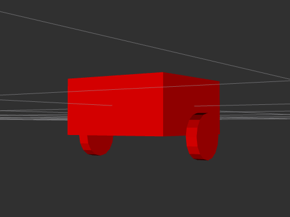

# URDFS or Uniform Resource Definition Files

## Setup

If you haven't done so yet, you need to create a ROS 2 workspace to hold the book code.

```bash
# Do the following if you haven't already created a workspace
mkdir -p ~/wr_book_ws/src && cd ~/wr_book_ws/src # Change this if you need a different name or location
git clone git@github.com:wimblerobotics/Robotics_Book.git
cd .. # Should be back at ~/wr_book_ws
colcon build --symlink-install
source install/setup.bash
```

## What is a URDF?

A URDF is a text file that describes a robot's pyhsical structure.
It can also be used, for instance, to create a simulated image of what the robot looks like.
It can also do more than just that, such a provide kinematic properties so that a full,
physics-base simulator can simulate the robot acting and moving in a simulated world.

For now, think of a URDF as a list of parts, called **links** and a list of descriptions
about how those links are connected, called **joints**.
We will start by creating a URDF that describes a two wheeled robot with a
square body. We will use the ROS tool called **rviz2** to visualize the URDF.

After that, we will add more complexity and eventually add in the use of a macro processor
to simpllfy how you write the description.

## Step 1: Creating your first URDF file

A URDF file is an XML file. You can create one using a simple text editor or an IDE toole
that aids you in writing an XML format file.
Let's begin with this simple URDF file which is in the
[1.urdf](../../description/urdf/1.urdf) file.

```xml
<?xml version="1.0"?>
<robot name="simple_robot">
  <link name="base_link">
    <visual>
      <geometry>
        <box size="0.5 0.5 0.25"/>
      </geometry>
      <pose>0 0 0.125 0 0 0</pose>
    </visual>
  </link>
  <link name="left_wheel">
    <visual>
      <geometry>
        <cylinder radius="0.1" length="0.05"/>
      </geometry>
    </visual>
  </link>
  <joint name="wheel_joint" type="continuous">
    <parent link="base_link"/>
    <child link="left_wheel"/>
    <origin xyz="0 -0.29 -0.13" rpy="1.5708 0 0"/>
    <axis xyz="0 1 0"/>
  </joint>
  <link name="right_wheel">
    <visual>
      <geometry>
        <cylinder radius="0.1" length="0.05"/>
      </geometry>
    </visual>
  </link>
  <joint name="right_wheel_joint" type="continuous">
    <parent link="base_link"/>
    <child link="right_wheel"/>
    <origin xyz="0 0.29 -0.13" rpy="1.5708 0 0"/>
    <axis xyz="0 1 0"/>
  </joint>

</robot>
  ```

Here is what the UDR file looks like using the rviz2 tool:



*

To see the visualization yourself, you can run the following command:

```bash
cd ~/wr_book_ws # Change this if you have a different workspace name
colcon build --symlink-install
source install/setup.bash
ros2 launch description description.launch.py urdf_file_name:="1.urdf"
```

## Explaining 1.urdf

The first line, `<?xml version="1.0"?>` , is the XML declaration. It tells the parser that this is an XML file and what version of XML it is.

The next line, `<robot name="simple_robot">` , is the start of the robot description. The `name` attribute is the name of the robot. The robot description ends with `</robot>` .

Next come link and joint pairs. Remember that link elements define real, physical components of the robot and joint elements define how those links are connected. In this case, we have three links: `base_link` , `left_wheel` , and `right_wheel` . We also have two joints: `wheel_joint` and `right_wheel_joint` .

The name `base_link` is chosen because the ROS [rep 105](https://www.ros.org/reps/rep-0105.html)
suggests that the base link should be the name of the link that is fixed to the world. I'll explain what that means later on.

The `base_link` link is a box with dimensions 0.5 x 0.5 x 0.25. The `left_wheel` and `right_wheel` links are cylinders with a radius of 0.1 and a length of 0.05. The `wheel_joint` and `right_wheel_joint` joints connect the `base_link` to the `left_wheel` and `right_wheel` links, respectively. The `wheel_joint` joint is located at the front of the robot, and the `right_wheel_joint` joint is located at the back of the robot.

The `origin` element specifies the position and orientation of the link or joint relative to its parent. The `axis` element specifies the axis of rotation for the joint.

## Step 2: Adding a caster wheel

Now let's add a caster wheel to the robot. The caster wheel will be a sphere that is connected to the back of the robot. Here is the updated URDF file, which is in the [2.urdf](../../description/urdf/2.urdf) file.

```xml
<?xml version="1.0"?>
<robot name="simple_robot">
  <link name="base_link">
    <visual>
      <geometry>
        <box size="0.5 0.5 0.25"/>
      </geometry>
      <pose>0 0 0.125 0 0 0</pose>
    </visual>
  </link>
  <link name="left_wheel">
    <visual>
      <geometry>
        <cylinder radius="0.1" length="0.05"/>
      </geometry>
    </visual>
  </link>
  <joint name="wheel_joint" type="continuous">
    <parent link="base_link"/>
    <child link="left_wheel"/>
    <origin xyz="0 -0.29 -0.13" rpy="1.5708 0 0"/>
    <axis xyz="0 1 0"/>
  </joint>
  <link name="right_wheel">
    <visual>
      <geometry>
        <cylinder radius="0.1" length="0.05"/>
      </geometry>
    </visual>
  </link>
  <joint name="right_wheel_joint" type="continuous">
    <parent link="base_link"/>
    <child link="right_wheel"/>
    <origin xyz="0 0.29 -0.13" rpy="1.5708 0 0"/>
    <axis xyz="0 1 0"/>
  </joint>
  <link name="caster_wheel">
    <visual>
      <geometry>
        <sphere radius="0.1"/>
      </geometry>
    </visual>
  </link>
  <joint name="caster_wheel_joint" type="continuous">
    <parent link="base_link"/>
    <child link="caster_wheel"/>
    <origin xyz="0 0 -0.13" rpy="0 0 0"/>
    <axis xyz="0 0 1"/>
  </joint>
</robot>
```
